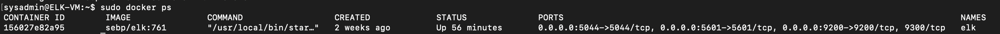

## Automated ELK Stack Deployment

The files in this repository were used to configure the network depicted below.

These files have been tested and used to generate a live ELK deployment on Azure. They can be used to either recreate the entire deployment pictured above. Alternatively, select portions of the plsybook file may be used to install only certain pieces of it, such as Filebeat.

  
  - [install_elk.yml](https://github.com/mserraino23/Cyber-Security-Project/blob/main/Ansible/install_elk_playbookyaml.docx)

This document contains the following details:
- Description of the Topologu
- Access Policies
- ELK Configuration
  - Beats in Use
  - Machines Being Monitored
- How to Use the Ansible Build

### Description of the Topology

The main purpose of this network is to expose a load-balanced and monitored instance of DVWA, the D*mn Vulnerable Web Application.

Load balancing ensures that the application will be highly efficient, in addition to restricting traffic to the network.
- This protects the servers from becoming overloaded, as well as protecting against Distributed Denial of Service (DDoS) attacks. A jump box allows you to block out all other traffic aside from the necessary communications from the gateway machine.

Integrating an ELK server allows users to easily monitor the vulnerable VMs for changes to the logs and system metrics and statistics.

- Filebeat watches for any information that has been changed, and when the change took place.
- Metricbeat records operating system metrics such as CPU or memory or data related to services running on the server

The configuration details of each machine may be found below.

| Name | Function | IP Address | Operating System |
|-|-|-|-|
| Jump-Box-Provisioner | Gateway | 10.0.0.4 | Linux |
| Web-1 | Server | 10.0.0.5 | Linux |
| Web-2 | Server | 10.0.0.6 | Linux |
| Elk1 | Server | 10.1.0.4 | Linux |

### Access Policies

The machines on the internal network are not exposed to the public Internet. 

Only the Jump-Box-Provisioner machine can accept connections from the Internet. Access to this machine is only allowed from the following IP addresses:
- 71.68.84.217
- Kibana can be accessed via URL from home IP address above.

Machines within the network can only be accessed by Jump-Box-Provisioner machine.
- Public IP 52.142.49.91
- Private IP 10.0.0.4

A summary of the access policies in place can be found in the table below.

| Name | Publicly Accessible | Allowed IP Addresses |
|-|-|-|
| Jump-Box-Provisioner | Yes | 71.68.84.217  |
| Web-1 | No | 10.0.0.4 |
| Web-2 | No | 10.0.0.4 |
| Elk1 | No | 71.68.84.217, 10.0.0.4 |
### Elk Configuration

Ansible was used to automate configuration of the ELK machine. No configuration was performed manually, which is advantageous because...
- You can deploy services and implement tasks to multiple servers using a single playbook.

The playbook implements the following tasks:
- Install docker.io
- Install Python-pip
- Install docker container
- Launch docker container: elk

The following screenshot displays the result of running `docker ps` after successfully configuring the ELK instance.

### Target Machines & Beats
This ELK server is configured to monitor the following machines:
- Web-1 (10.0.0.5)
- Web-2 (10.0.0.6)

We have installed the following Beats on these machines:
- Filebeat

These Beats allow us to collect the following information from each machine:
- Filebeat allows us to collect changes made, and determines when those changes were made.

### Using the Playbook
In order to use the playbook, you will need to have an Ansible control node already configured. Assuming you have such a control node provisioned: 

SSH into the control node and follow the steps below:
- Copy the playbook file to /etc/ansible.
- Update the host file to include

        - [webservers]
        - [ip address] ansible_python_interpreter=/usr/bin/python3
        - [ip address] ansible_python_interpreter=/usr/bin/python3
        
        - [elk]
        - [ip address] ansible_python_interpreter=/usr/bin/python3
- Run the playbook, and navigate to SSH to your container and double check that your elk-docker container is running to check that the installation worked as expected by running sudo docker ps.

_TODO: Answer the following questions to fill in the blanks:_
- _Which file is the playbook? Where do you copy it?_

- Playbook: install_elk.yml 
- Location: /etc/ansible/install_elk.yml

- Which file do you update to make Ansible run the playbook on a specific machine? How do I specify which machine to install the ELK server on versus which to install Filebeat on?

- The file you need to update is the filebeat.yml file which is a configuration file that will be dropped into the Elk-Server during the run of the ansible-playbook. When you update the host.cfg file in the ansible directory you will need to create a new group called [elkservers] and add the Private IP of the Elk-Server to the group. Then when configuring the filebeat.yml file you need to designate the Private IP of the Elk-Server in two lines of the .yml file. Lines 1106 and 1806 are the needed to be updated with the Private IP.
- Which URL do you navigate to in order to check that the ELK server is running?
- - Navigate to  http://[your.ELK-VM.External.IP]:5601/app/kibana to confirm ELK and kibana are running.

The commands needed to run the Ansible configuration for the Elk-Server are:
- ssh RedAdmin@JumpBox(PrivateIP)
- sudo docker container list -a (locate your ansible container)
- sudo docker start container (name of the container)
- sudo docker attach container (name of the container)
- cd /etc/ansible/
- ansible-playbook elk.yml (configures Elk-Server and starts the Elk container on the Elk-Server) wait a couple minutes for the implementation of the Elk-Server
- cd /etc/ansible/roles/
- ansible-playbook filebeat-playbook.yml (installs Filebeat and Metricbeat)
